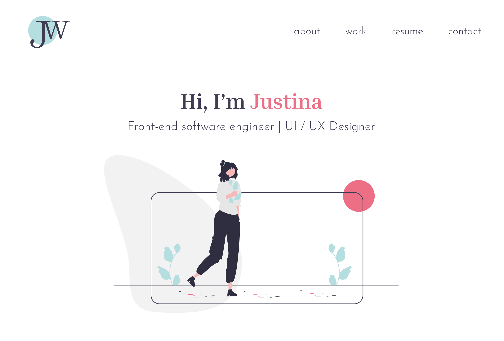
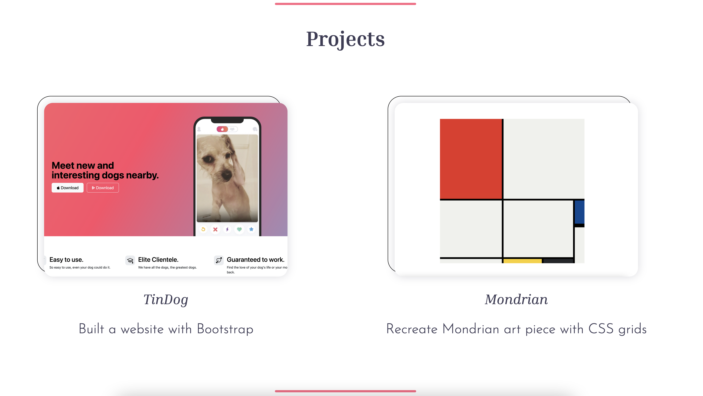

# My Portfolio Site

This portfolio website is completely coded from scratch with HTML and CSS, and is a capstone project from the Web Development Bootcamp with Angela Yu.

[Figma design here](https://www.figma.com/file/rd5ipo71RriSUoCpDt4Xi0/Portfolio-Site?type=design&node-id=0%3A1&mode=design&t=M68jqxxwgzt4wspw-1)

Illustrations credited Katerina Limpitsouni at unDraw
UI icons credited to UXWing

## Tech Stack

- HTML
- CSS

## Screenshots

### Hero

## Projects

## Next Steps

- Continue working on responsiveness for mobile
- Expand on the contact section, such as creating a contact form
